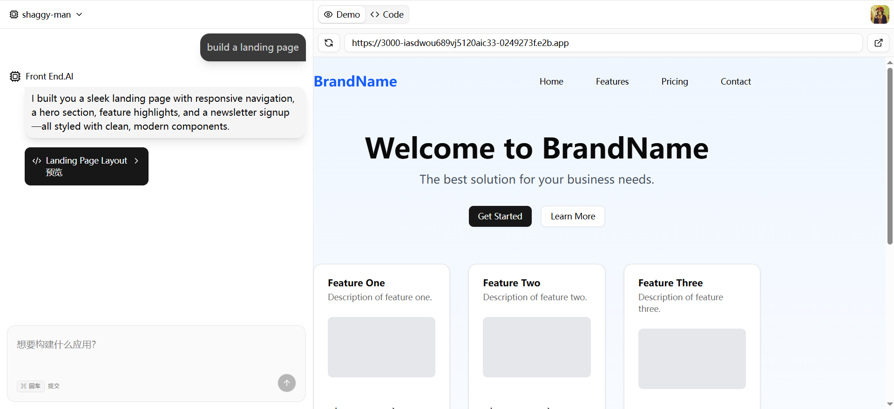
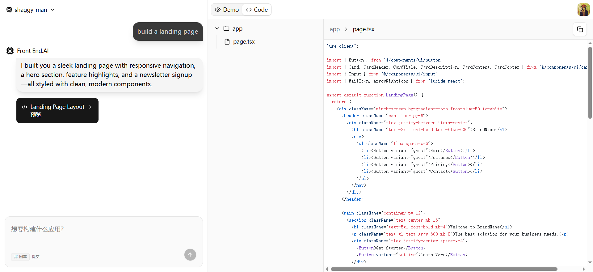

# Next-AI-Generator-Code

### 介绍

Next-AI-Generator-Code，基于 Next.js、shadcn/ui、TailWind css、E2B、Inngest、Prisma ORM、Neon 的一套 AI 生成代码项目。

### 一、在线预览地址

- vercel(需要翻墙)：https://next-ai-generator-code.vercel.app

### 二、Git 仓库地址 (欢迎 Star⭐)

- GitHub：https://github.com/zczhao1992/next-ai-generator-code.git

### 三、🔨🔨🔨 项目功能

- 🚀 采用最新技术找开发：Next15、TypeScript、shadcn/ui、TailWind css、Inngest 等
- 🚀 使用 Clerk 作为身份认证，支持 Google、Github 账号登录
- 🚀 使用 Prisma ORM 及 PostgreSQL 作为数据库存储工具，数据库部署在 Neon
- 🚀 整个项目集成了 TypeScript
- 🚀 使用 Inngest 构建 AI 工作流
- 🚀 使用 Next-Intl 提供多语言（英语、中文）
- 🚀 集成 DeepSeek AI 提供生成代码能力

### 四、安装使用步骤 📑

- **Clone：**

```text
# GitHub
git clone https://github.com/zczhao1992/next-ai-generator-code.git
```

- **Install：**

```text
npm install
cnpm install

# npm install 安装失败，请升级 nodejs 到 22 以上，或尝试使用以下命令：
npm install --registry=https://registry.npm.taobao.org
```

- **Run：**

```text
npm run dev
```

- **Build：**

```text
# 开发环境
npm run build
```

### 五、项目截图

#### 1、首页：


#### 2、AI 项目：




### 六、文件资源目录 📚

```text
next-ai-generator-code
├─ prisma                 # prisma orm
├─ public                 # 静态资源文件（忽略打包）
├─ src
│  ├─ app                 # 项目页面
│  ├─ components          # 全局组件
│  ├─ generated           # ORM类型
│  ├─ hooks               # 自定义hook
│  ├─ i18n                # 多语言
│  ├─ inngest             # 工作流函数
│  ├─ lib                 # 工具
│  ├─ modules             # 业务模型
│  ├─ trpc                # trpc模块
│  ├─ constants.ts        # 静态内容
│  ├─ middleware.ts       # 中间件
│  ├─ prompt.ts           # 提示词
│  └─ types.ts            # 类型
├─ .eslintrc.json         # eslint配置
├─ .gitignore             # git 提交忽略
├─ components.json        # shadcn/ui 组件配置
├─ next-env.d.ts          # 环境变量配置
├─ package-lock.json      # 依赖包包版本锁
├─ package.json           # 依赖包管理
├─ postcss.config.js      # postcss 配置
├─ README.md              # README 介绍
├─ tailwind.config.ts     # tailwind 配置
└─ tsconfig.json          # typescript 全局配置
```
